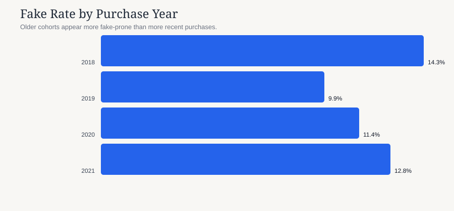
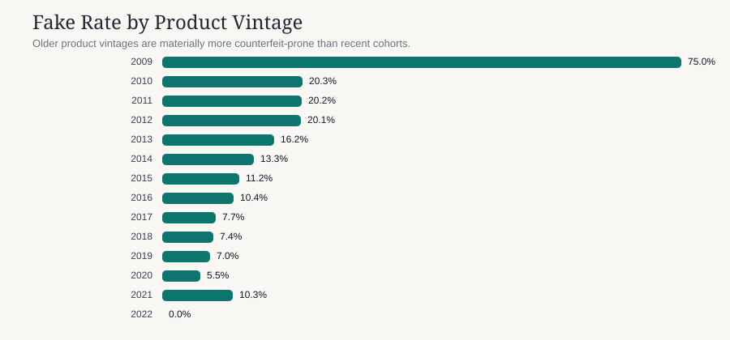
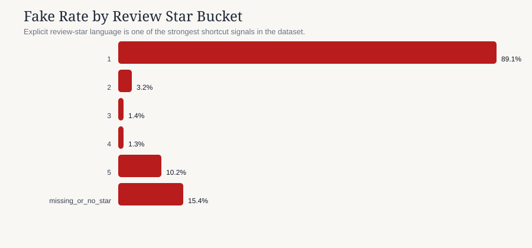
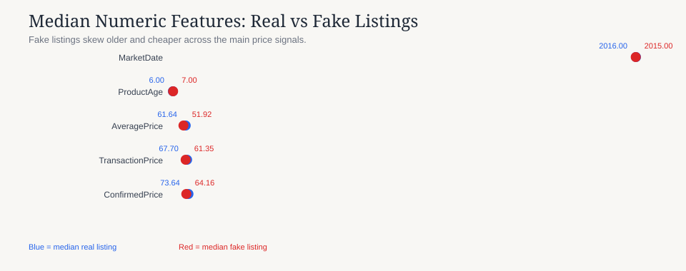

# Executive Summary

## Situation

Amazing needs a practical way to identify likely fake listings on a marketplace platform. This summary focuses on the current data landscape, business-relevant risks, and the most practical modeling direction for immediate execution.

## Key Findings

- The dataset contains **11,358 transactions** with a **10.7% fake rate**, so the task is moderately imbalanced rather than extremely rare-event.
- There are **522 exact duplicates** and **20 conflicting duplicate-like rows**, which is manageable but worth cleaning before any future modeling.
- `top_review` is missing in **19.1%** of rows, and the missing/no-star bucket itself carries a **15.4% fake rate**.
- Explicit `1/5 stars` language is a major shortcut signal: those rows show an **89.1% fake rate**, far above the base rate.
- The sharpest interaction is **BUSINESS | Missing value** at **80.0%** fake rate, which suggests operations metadata is interacting with listing quality rather than acting independently.
- Product repetition is extreme: **11,177 rows** belong to repeated product names, so naive random row splits would likely overstate generalization.
- Fake listings skew older and cheaper on median: `MarketDate` median shifts from **2016** to **2015**, while `TransactionPrice` median moves from **67.70** to **61.35**.
- Pricing above confirmed references is also risky: the fake rate rises from **9.5%** in the `0.8-1.0x` bucket to **14.6%** once listings exceed `1.2x` confirmed price.

## Business Interpretation

The most important operational takeaway is that the dataset contains both **meaningful product-risk signals** and **suspicious shortcut signals**. For example, delivery metadata and explicit review-star language appear unusually predictive. That can be useful for triage, but it also means a model could look strong offline while learning artifacts that may not hold up in production.

The highest-risk delivery bucket in the current sample is **Missing value** with a fake rate of **63.5%** across **446 rows**. Among large geographies, **Oslo** shows the highest fake rate in the current slice, and **Pet Supplies Birds** is the most exposed broad category with enough support to matter operationally.

The most important refinement from the deeper slice analysis is that **missing delivery metadata behaves very differently across fulfillment flows**. When delivery data is missing, the fake rate jumps to **63.5%** overall, but the interaction table shows that BUSINESS and CENTRAL flows are especially exposed. That is the sort of pattern a production model would exploit immediately, and it is also the sort of pattern that needs policy review before being trusted blindly.

## Data Quality And Evaluation Risks

- Duplicate management matters: 522 exact duplicates and 20 conflicting duplicate-like rows should be handled consistently before training.
- Product repetition is the main evaluation hazard: 11,177 rows belong to repeated `Brand + ProductName` pairs.
- Review availability is non-random: missing or unparseable review-star information carries a 15.4% fake rate.
- Numeric signals move in the expected direction for counterfeits: fake rows have older platform vintages and lower median transaction/reference prices.

## Signal Inventory

| signal | observation | why_it_matters |
| --- | --- | --- |
| DeliveryCategory | Missing value has the highest fake rate among large buckets | Strongly predictive, but may encode process artifacts rather than intrinsic product quality. |
| Fulfillment x delivery | BUSINESS \| Missing value reaches 80.0% | The risk is strongest in interaction form, not just in the single-column marginal view. |
| Review stars | 1-star reviews are disproportionately fake-heavy | Useful for triage, but risky if reviews are synthetic or unavailable at listing time. |
| Repeated products | 522 product names repeat across the dataset | Entity leakage is a real evaluation risk and needs split discipline. |
| Price references | ConfirmedPrice median is 73.64 for real vs 64.16 for fake | Relative price gaps look promising for a compact tabular model later on. |
| Brand concentration | Cosequin is the highest-risk brand bucket with enough support | Some brand families may need targeted policy review or SKU-level monitoring. |

### Text Clues Worth Monitoring

| token | fake_rows | real_rows |
| --- | --- | --- |
| product | 578 | 3272 |
| get | 427 | 711 |
| best | 413 | 688 |
| buy | 317 | 98 |
| dont | 269 | 213 |
| amazing | 258 | 323 |

### Temporal View

| purchase_year | count | fake_count | fake_rate |
| --- | --- | --- | --- |
| 2018 | 28 | 4 | 14.2857 |
| 2019 | 5460 | 541 | 9.9084 |
| 2020 | 5831 | 667 | 11.4389 |
| 2021 | 39 | 5 | 12.8205 |

### Interaction View

| label | count | fake_count | fake_rate |
| --- | --- | --- | --- |
| BUSINESS \| Missing value | 155 | 124 | 80.0 |
| CENTRAL \| Missing value | 160 | 117 | 73.125 |
| MARKETPLACE \| Missing value | 131 | 42 | 32.0611 |
| MARKETPLACE \| PRIME | 3391 | 373 | 10.9997 |
| BUSINESS \| PRIME | 1125 | 104 | 9.2444 |
| MARKETPLACE \| DIRECT | 2846 | 224 | 7.8707 |

### Pricing View

| price_ratio_bucket | count | fake_count | fake_rate |
| --- | --- | --- | --- |
| <0.8x | 2639 | 257 | 9.7385 |
| 0.8-1.0x | 4660 | 441 | 9.4635 |
| 1.0-1.2x | 2349 | 270 | 11.4943 |
| >=1.2x | 1594 | 233 | 14.6173 |
| missing | 116 | 16 | 13.7931 |

### Product Vintage View

| market_year | count | fake_count | fake_rate |
| --- | --- | --- | --- |
| 2009 | 4 | 3 | 75.0 |
| 2010 | 59 | 12 | 20.339 |
| 2011 | 178 | 36 | 20.2247 |
| 2012 | 417 | 84 | 20.1439 |
| 2013 | 795 | 129 | 16.2264 |
| 2014 | 1375 | 183 | 13.3091 |
| 2015 | 1913 | 214 | 11.1866 |
| 2016 | 2173 | 226 | 10.4004 |
| 2017 | 2001 | 155 | 7.7461 |
| 2018 | 1445 | 107 | 7.4048 |
| 2019 | 740 | 52 | 7.027 |
| 2020 | 217 | 12 | 5.53 |
| 2021 | 39 | 4 | 10.2564 |
| 2022 | 2 | 0 | 0.0 |

## Recommended Modeling Direction

For the minimum viable modeling path, TabPFN v2 is a strong core choice because it provides a powerful tabular foundation model without a long training cycle. For this dataset, the practical move is to convert mixed marketplace signals into scalar features, run TabPFN v2 as the first production-grade baseline, and keep the PyTorch fusion model as the next custom upgrade only if we need more flexibility.

Recommended order of operations:

1. Start with TabPFN v2 on numeric, categorical, missingness, and lightweight text-derived scalar features.
2. Evaluate with time-aware or entity-aware splits rather than naive random rows.
3. Run ablations that remove review stars, delivery metadata, and other shortcut-heavy fields.
4. Move to the custom PyTorch hybrid only if the TabPFN baseline leaves meaningful headroom.

## What We Would Do Next

- Implement a CPU/GPU-ready PyTorch 2 training path using the existing model stubs.
- Compare tabular-only, text-only, and fused models under a temporal split.
- Calibrate probabilities and define separate thresholds for auto-blocking versus manual review.
- Stress-test the model without review stars and without delivery metadata to measure reliance on possible artifacts.
